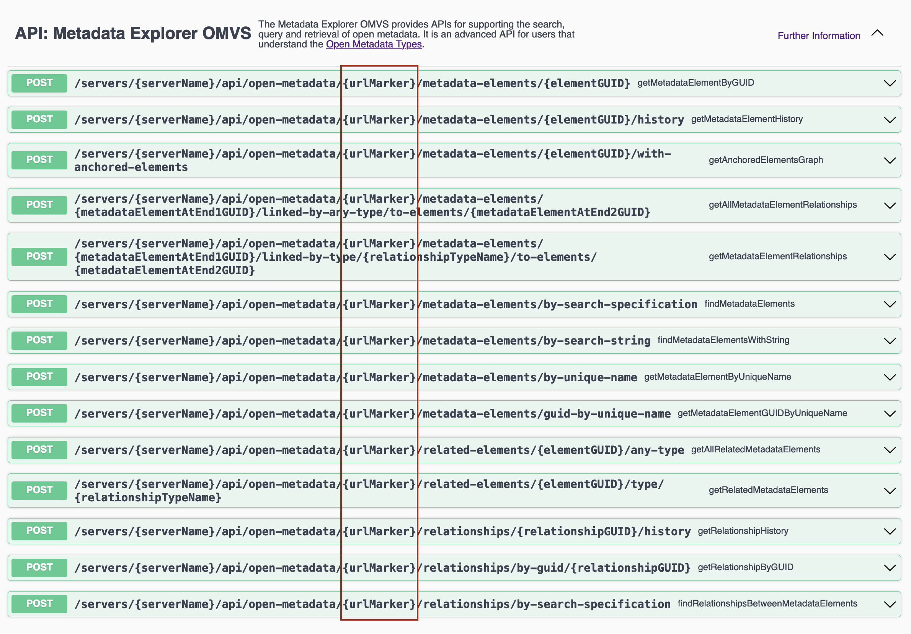

<!-- SPDX-License-Identifier: CC-BY-4.0 -->
<!-- Copyright Contributors to the Egeria project. -->

--8<-- "snippets/content-status/stable.md"

# Metadata Explorer OMVS

The Metadata Explorer Open Metadata View Services (OMVS) is a REST API that supports the search, query and retrieval of open metadata.  It is an advanced API for users that understand the [Open Metadata Types](/types) because the searches are expressed using these types and the attributes they define, and the results directly reflect the elements and relationships they define.  There are simpler, more specialized search operations in the other view services.

The Metadata Explorer OMVS has 12 different types of search operation.  The first four retrieve details about a single metadata element.

* getMetadataElementByGUID - Retrieve the metadata element using its unique identifier (guid).
* getMetadataElementByUniqueName - Retrieve the metadata element using its unique name (typically the *qualifiedName* attribute but other attributes can be used if they are unique - such as *pathName* for a file).
* getMetadataElementGUIDByUniqueName - Retrieve the metadata element's unique identifier (guid) using its unique name (again, typically the *qualifiedName* attribute but other attributes can be used if they are unique - such as *pathName* for a file).
* getMetadataElementHistory - Retrieve all the versions of an element.

The next four operations retrieve the relationships linked to an element, and the element attached at the far end of each relationship.

* getAllRelatedMetadataElements - Retrieve the metadata elements connected to the supplied element.
* getRelatedMetadataElements - Retrieve the metadata elements connected to the supplied element via a specific relationship type.
* getAllMetadataElementRelationships - Retrieve the relationships linking the supplied elements.
* getMetadataElementRelationships - Retrieve the relationships linking the supplied elements via a specific type of relationship.

The next command retrieves a graph of elements that are all anchored to the supplied starting element.

* getAnchoredElementsGraph - Return all the elements that are anchored to an element plus relationships between these elements and to other elements.

The next few operations retrieve lists of elements that contain properties (attributes and/or header values) that match the request.

* findMetadataElementsWithString - Retrieve the metadata elements that contain the requested string in any attribute.  The string is interpreted as a simple regular expression.
* findMetadataElements - Return a list of metadata elements that match the supplied criteria.  The results can be returned over many pages.
* findRelationshipsBetweenMetadataElements - Return a list of relationships that match the requested conditions.  The results can be received as a series of pages.

The final two operations allow you to retrieve details of a specific relationship, along with summary information about the elements at each end.

* getRelationshipByGUID - Retrieve the relationship using its unique identifier.
* getRelationshipHistory - Retrieve all the versions of a relationship.

## Common request options

### Paging

Requests that return multiple results have optional request parameters to specify paging options of *startFrom* and *pageSize*.  If they are not specified, their default value is 0.

* *startFrom* is the starting offset in the total stored metadata.  0 means start with the first result found.
* *pageSize* describes the maximum results to retrieve from each repository in a single request.  A value of 0 means use the server's maximum page size.  The actual number of results returned to the caller may be less if filtering occurs due to, say, security settings.  There may be more is the request is sent to a cohort as a federated query and the repositories have very different content.

So if you were receiving a lot of results over a number of requests, the first request has *startFrom=0* and *pageSize* set to a positive number.  The next request would have *startFrom=startFrom+pageSize* and the same value for *pageSize*.

If no results are found in any connected repository, a null result is returned.  If results are found, but they are all filtered out, then an empty array is returned, indicating to retrieve the next page.  There is more information on paging in the [Developer's Guide](/guides/developer/finding-metadata/overview/#paging).

### Controlling time

The request body of the requests includes the following two options to use time to specify what should be returned.

* effectiveTime - the effective time assigned to the element.  Null means any effective time.
* asOfTime - repository time that should be used when retrieving metadata.  Null means use the current contents.  An ISO time (GMT) indicates use the contents that were present at the specified from.

### Limiting the status of the results

The *ElementStatus* enum defines the status of an element in the metadata collection.  It effectively defines its visibility to different types of queries.  The [Open Metadata Types](/types) define which statues can be used with each type of element. Typically, it is ACTIVE and DELETED, but some types are more exotic. Most queries by default will only return instances not in the DELETED status. However, the *limitResultsByStatus* field in the request body can be used to define the required statuses of the results returned.  This includes the DELETED status to retrieve elements that are soft-deleted.  These are that values for element status that you can use.

* DRAFT: The content is incomplete.
* PREPARED: The content is in review.
* PROPOSED: The content is ready for review.
* APPROVED: The content is approved.
* REJECTED: The request or proposal is rejected.
* APPROVED_CONCEPT: The request or proposal is approved for development.
* UNDER_DEVELOPMENT: The instance is being developed.
* DEVELOPMENT_COMPLETE: The development of the instance is complete.
* APPROVED_FOR_DEPLOYMENT: The instance is approved for deployment.
* STANDBY: The instance is deployed in standby mode.
* ACTIVE: The instance is approved and in use.
* FAILED: The instance is not in use due to failure.
* DISABLED: The instance is shutdown or disabled.
* COMPLETE: The activity associated with the instance is complete.
* DEPRECATED: The instance is out of date and should not be used.
* OTHER: The instance is in a locally defined state.
* DELETED: The instance has been deleted and is waiting to be purged.  It is kept in the metadata collection to support a restore request.  It is not returned on normal queries.

There is more information on these statuses [here](/concepts/instance-status).

### Ordering results

The request bodies of the requests that request how the results are ordered.  

SequencingOrder is used for search requests against a metadata collection.  It defines how the results should to be ordered before they are returned.  This is particularly important when the results are to returned over multiple pages since the caller does not have all the results at once to perform the sort themselves.  The sequencing order values are:

* ANY: return the results in any order.  This is default.
* GUID: return in GUID sequence.  This is used when the caller just needs a consistent order in the order that results are returned.
* CREATION_DATE_RECENT: return in the order that the elements were created with the most recent ones first.
* CREATION_DATE_OLDEST: return in the order that the elements were created with the oldest ones first.
* LAST_UPDATE_RECENT: return in the order of the latest update with the most recent first.
* LAST_UPDATE_OLDEST: return in the order of the latest update with the oldest first.
* PROPERTY_ASCENDING: return in ascending order of the values in a sequencing property.  The sequencing property will be supplied in the *sequencing* parameter.
* PROPERTY_DESCENDING: return in descending order of the values in a sequencing property.  The sequencing property will be supplied in the *sequencing* parameter.

Note: not all repositories support ordering.  The results may vary between repository types.

### Using the urLMarker

Metadata Explorer OMVS contains operations that are useful in many scenarios. For that reason it is implemented as a *View Server Generic Service*.  This means that firstly, it is always running in a view server.  Secondly, each of its operations' URL has a segment that is specified as `{urlMarker}`.  

> The `urlMarker` in Metadata Explorer OMAS's REST API operations.

This segment of the URL normally takes the URL marker for the particular view service it belongs to.  (For example `metadata-explorer` for the Metadata Explorer OMVS, or `asset-catalog` for Asset Catalog OMVS).  The `{urlMarker}` allows the use of the URL marker for any view service that is configured in the view server. 

???+ tip "How do I find out the URL marker for a service?"
    The URL marker is derived from the name of the requested service - take the short two-word service name, convert to lower case and add a hyphen between the two words - so Feedback Manager OMVS's URL Marker is feedback-manager.

When the request is received by Metadata Explorer OMVS, it uses the supplied URL marker to look up the configuration of the requested view service.  It then issues the desired request(s) to the partner [metadata access server](/concepts/metadata-access-server) configured for the requested view server.

The reason this feature is useful is that each view service is configured to call an [Open Metadata Access Service (OMAS)](/services/omas) running in a specific [Metadata Access Server](/concepts/metadata-access-server).  They do not all have to be set to call the same server.  

> This example show a view server where its view services are configured to point to different metadata access stores.

Each access service in each server can be set up to support a restrictive set of [governance zones](/features/governance-zoning/overview).  This controls the visibility of assets returned to the callers.  If, for example, a user interface was calling Asset Catalog OMAS to provide information about assets for its user, this service would call Asset Consumer OMAS in the metadata store.  It could be set up to only return assets of a particular quality.  If the UI needed to also perform a complex query using Metadata Explorer OMVS, it could set the URL Marker to be "asset-catalog" and the request would be passed to the same Asset Consumer OMAS as the other Asset Catalog OMAS calls - and so returning assets with the same visibility.

???+ education "If Metadata Explorer OMVS is always active, do I need to configure it in my view server?"
    You only need to configure Metadata Explorer OMVS if you want to use the `metadata-explorer` URL Marker to call the Asset Consumer OMAS in a specific Metadata Access Store.

### Additional request parameters

There are optional request parameters for lineage and duplicate processing requests.

* forLineage (default=false) - set this request parameter to true if this request is to support a lineage query - it will include the mementos representing elements in the graph that are deleted.
* forDuplicateProcessing (default=false) - set this request parameter to true if the query is supporting deduplication processing and so it turns off the automatic deduplicate processing

## A note on the use of regular expressions (RegEx)

Egeria supports a limited dialect of regular expressions due to the capabilities of the search indexes (such as lucene) and the underlying persistent stores (such as PostgreSQL).  Each regular expression acts on only one property and begins relative to the start of that property, so the use of the caret character (^) is not needed.

### Safeguarding against harmful regular expressions

Complex regular expression have been used to perpetrate a denial of service attack on systems that support them.  Typically this is done using a recursive regular expression.  Egeria protects the metadata access server and backing persistent store by testing each regular expression from users in the view server.  Any regular expression that takes too long to execute is rejected.  A denial of service attack then only has the opportunity to damage the view servers which can be re-spun and scaled out while the governance servers and metadata access servers are protected.

---8<-- "snippets/abbr.md"

